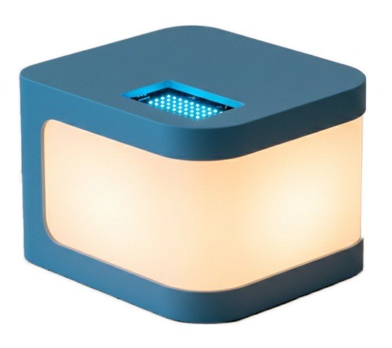
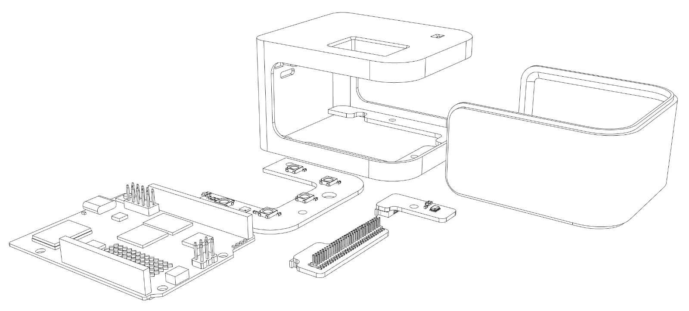

# UNO Q EchoGlow Workshop




The UNO Q EchoGlow is an AI-powered desktop light that can be operated with voice commands. It detects the keyword "Hey Arduino" through an analog microphone connected directly to the Arduino UNO Q, and toggles a NeoPixel strip connected via the onboard Qwiic port. These commands can be trained on Edge Impulse’s platform, and then uploaded to the Arduino UNO Q inside the EchoGlow. 
Be sure to visit the project every now and then to check for updates and downloads:

This setup uses the analog microphone input of the Arduino UNO Q instead of a USB microphone (unlike the standard keyword-spotting example), requiring a one-time board configuration before launching the app.

[https://hackaday.io/project/205386-arduino-uno-q-echoglow](https://hackaday.io/project/205386-arduino-uno-q-echoglow
)

## Bricks Used

- `keyword_spotting` — detects sound patterns and triggers an event when a keyword is matched.

## Hardware and Software Requirements



### Hardware

- [Arduino® UNO Q](https://store.arduino.cc/products/uno-q)
- SupplyFrame analog microphone board (connected to the analog mic input)
- SupplyFrame NeoDriver I2C board (address `0x60`) with NeoPixel strip, connected to the Qwiic port

### Software

- Arduino App Lab
- One-time board setup — see [Setup](#setup) below

## Setup

> **This step is required once per board.** It configures the ALSA audio subsystem, creates the device symlink expected by `arduino-app-cli`, and patches the Docker image to support the analog microphone.

Clone the repository on the Arduino UNO Q and run the setup script:

```bash
sudo git clone https://github.com/ElectronicCats/Qualcomm-Arduino-Edge-WS2026
cd Qualcomm-Arduino-Edge-WS2026
sudo Software/setup-arduino-q-mic-applab.sh
```

After the script completes, **reboot the board**:

```bash
sudo reboot
```

The script copies this example to `/home/arduino/ArduinoApps/` automatically. If you need to re-deploy it manually:

```bash
sudo Software/setup-arduino-q-mic-applab.sh --deploy-example
```
#### Notes:
```
When running this firmware, only the analog microphone is available (no USB microphone). To revert this, format the UNO Q. 
```

## How to Use the Example

### Hardware Setup

1. Connect the analog microphone board to the analog mic input of the Arduino UNO Q.
2. Connect the SupplyFrame NeoDriver I2C board to the **Qwiic port** on the Arduino UNO Q.
3. Connect a NeoPixel strip to the NeoDriver (up to 5 pixels supported out of the box).


### Launch the App

1. Open **Arduino App Lab** and connect to the board using **Network Mode**.
2. Open this example and click the **Play** button in the top right corner.
3. Wait for the app to launch.


4. Say **"Hey Arduino"** into the microphone.
5. The NeoPixel strip toggles green on the first detection, and off on the next.

### How it Works

The `keyword_spotting` Brick continuously monitors the analog microphone input for the keyword **"Hey Arduino"**. When detected, it calls the microcontroller via the Bridge, which toggles the NeoPixel strip.


#### Why a setup script is needed

The Arduino UNO Q uses a **Qualcomm QRB2210 SoC** with a Qualcomm LPASS audio DSP (Q6ASM). This DSP resets all ALSA mixer controls to `off` every time an audio capture session closes. The setup script:

- Configures the ALSA mixer and installs a systemd service that re-applies the configuration at boot.
- Creates the `/dev/snd/by-id` device symlink expected by `arduino-app-cli` to detect the microphone.
- Patches the Docker image used by `arduino-app-cli` so that its Python `Microphone` class re-runs the mixer setup before opening each PCM session, and uses the full ALSA device name (`plughw:CARD=ArduinoImolaHPH,DEV=2`) required inside containers.

### Understanding the Code

**Python side (`python/main.py`):**

- `spotter = KeywordSpotting()` — initializes the audio listener on the analog mic input.
- `spotter.on_detect("hey_arduino", on_keyword_detected)` — registers the callback for the "Hey Arduino" keyword.
- `Bridge.call("keyword_detected")` — notifies the microcontroller that the keyword was detected.

**Microcontroller side (`sketch/sketch.ino`):**

- `seesaw_NeoPixel strip(..., &Wire1)` — the NeoDriver is on `Wire1`, which maps to the Qwiic port on the UNO Q.
- `Bridge.provide("keyword_detected", wake_up)` — registers the handler called by the Python side.
- `wake_up()` — toggles the NeoPixel strip between green and off on each detection.
